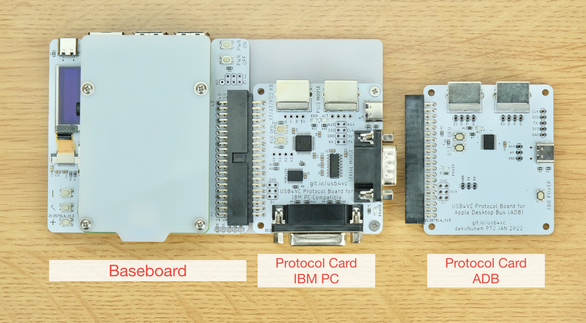
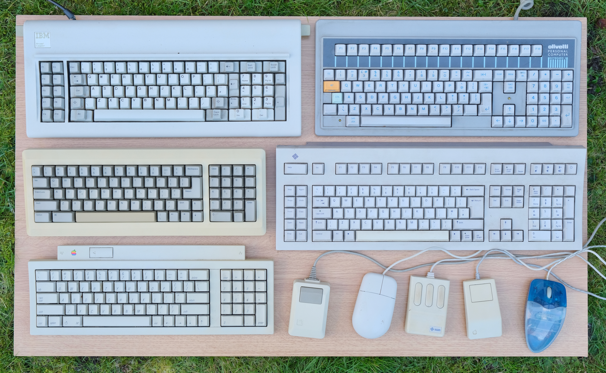
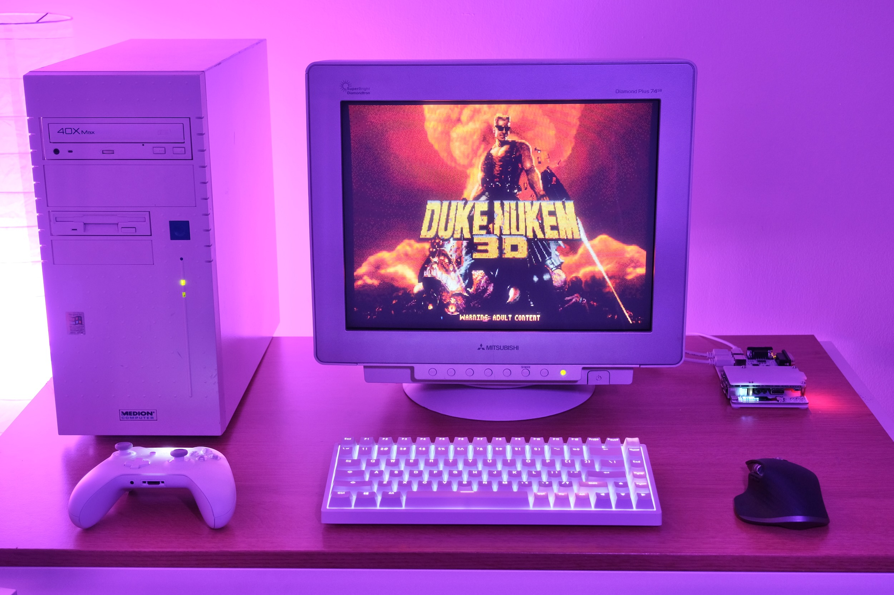

# USB4VC: USB Inputs on Retro Computers!

[Get USB4VC](kickstarter_info.md) | [Official Discord](https://discord.gg/HAuuh3pAmB) | [Getting Started](getting_started.md) | Table of Contents

-----

USB4VC is an **active protocol converter** that let you use **USB keyboard, mouse, and gamepads** on a wide range of retro computers.

With a **modular design**, different platforms are supported by swapping out **Protocol Cards**:

Two Protocol Cards are available at launch (March 2022):

#### IBM PC Compatible

* PS/2 Keyboard
* PS/2 Mouse
* XT Keyboard
* Serial Mouse
* 15-pin Gameport Gamepad
* Mapping USB Gamepad to PC Mouse/Keyboard

#### Apple Desktop Bus (ADB)

* ADB Keyboard
* ADB Mouse
* Mapping USB Gamepad to ADB Mouse/Keyboard

Of course, more are planned after launch!

## Promo Video

Click to see USB4VC in action!

<table>
  <tr>
    <td></td>
  </tr>
</table>

## Get One / Stay in Touch

A [Kickstarter campaign](kickstarter_info.md) is planned for USB4VC around **early March 2022**.

Please [sign up for launch notification](https://www.kickstarter.com/projects/dekunukem/usb4vc-usb-inputs-on-retro-computers) if you're interested! More Protocol Cards are on the way!

**Questions or comments?** Ask in [official Discord](https://discord.gg/HAuuh3pAmB), raise a [Github issue](https://github.com/dekuNukem/USB4VC/issues), [Twitter DM](https://twitter.com/dekuNukem_), or email `dekunukem` `gmail.com`!

## Beta Testing

I would love to test USB4VC on more machines before public release, so if you have a decent working PC/Mac collection, let me know and I can send you one for testing!

Especially looking for:

* Testing on IBM PC XT/AT original and clones

* PS4/PS5/Xbox Series X/S controllers for compatibility testing

Everyone welcome, but **UK** users preferred due to shipping time and cost. 

Let me know via [Discord](https://discord.gg/HAuuh3pAmB), [Twitter DM](https://twitter.com/dekuNukem_), or email `dekunukem` `gmail.com`!

## Highlights

* USB Keyboard/Mouse/Gamepads on Vintage Computers!

* Modular & Swappable Protocol Cards

* Wireless / Bluetooth

* Ultra Low Latency (0.5ms)

* OLED Display

* USB-C Powered

* Fully Open-source

## How it Works

USB4VC consists of two halves: **Baseboard** and swappable **Protocol Cards**.

The Baseboard contains user buttons, OLED screen, and a Raspberry Pi. It handles UI and input events, which are processed and sent to Protocol Card.

Each Protocol Card has a dedicated microcontroller and the appropriate connectors for the target computer.

By splitting duties, RPi can focus on input parsing, and P-Card handles timing critical signal generation, resulting in a flexible architecture and reliable performance.

USB peripherals can be connected via cables, wireless dongles, or Bluetooth.

## Why?

Before the homogeneity of USB peripherals today, computer input devices were a wild west of proprietary protocols and connectors, as different platforms used their own keyboards, mice, and gamepads.

With the popularity of retro computing today, it poses several issues:

* Many proprietary peripherals are simply **hard to find**, commanding a premium on online marketplaces. They are only getting rarer, and without them, the computer itself is useless.

* After 3 or 4 decades of service, many can be **degraded and unreliable** (e.g. foam & foil keyboards), requiring extensive restoration.

* Let's be honest here, most early peripherals simply **does not feel that great**. Mushy membrane keyboards, sticky ball mice, plasticky gamepads, etc. And of course, the good ones gets [*very expensive*](https://www.ebay.com/sch/i.html?_nkw=ibm+model+f&_sacat=0&rt=nc&LH_Sold=1&LH_Complete=1).

* On the other hand, high quality USB peripherals can be had for a very reasonable price today with vastly **superior tactility, precision, and ergonomics**.

* Thus, this project aims to make retro computers simply **more enjoyable to use**.

* I also hope it can put more computers back in action, lower the barrier of entry for certain machines, and generally help more people get into this hobby!

But of course, one can argue that using period-correct peripherals is simply part of the experience, but just like the HDMI upscalers or floppy emus, it's nice to have the option to enhance the experience.

## Getting Started

[Click me](getting_started.md)

## Technical Details

[Click me](technical_notes.md)

## Roadmap / Future Plans

Current focus is having a smooth project launch. So for the first few months I will mostly be working on maintaining Kickstarter campaign, shipping orders, and providing updates and bug fixes for existing Protocol Cards.

Of course, more Protocol Cards are planned. Not making any guarantees at this moment, but a shortlist include:

* OG Macintosh/128K/512K/Mac Plus
* Olivetti M24 / AT&T PC 6300
* SUN SPARCstation

Want more? Feel free to [get in touch](#get-one--stay-in-touch) and make suggestions!

## Q&A

### Where can I get one?

A [Kickstarter campaign](kickstarter_info.md) is planned around **March 2022**. Please [sign up for launch notification](https://www.kickstarter.com/projects/dekunukem/usb4vc-usb-inputs-on-retro-computers) if you're interested!

Public release will commence after all Kickstarter orders have been fulfilled, probably around April or May 2022.

### Which Raspberry Pi can I use?

USB4VC is tested on **Raspberry Pi 1/2/3/4 Model B**.

Raspberry Pi Zeros should work too, but would need a USB hub.

Earlier Pis might lack built-in Bluetooth.

### What about latency?

0.5ms to 1ms depending on the Raspberry Pi generation.

1ms is *one thousandth* of a second. [More info here](technical_notes.md#latency-information).

### Can you develop a Protocol Card for ___ ?

I'd love to! But I would need a working machine with working peripherals.

So if you're in UK and is happy to lend me one for a while, [let me know!](#get-one--stay-in-touch)

Also, as I can only work on so many at once, I'll probably focus on the popular machines at first, but still, do let me know! 

### Can I make my own Protocol Cards?

Of course! Detailed instructions will be provided after public availability.

Feel free take a look at [technical notes in the meantime](technical_notes.md).

### What does USB4VC stand for?

USB for Vintage Computers. Although come to think of it, it's perfect for vintage consoles too 🤔!

