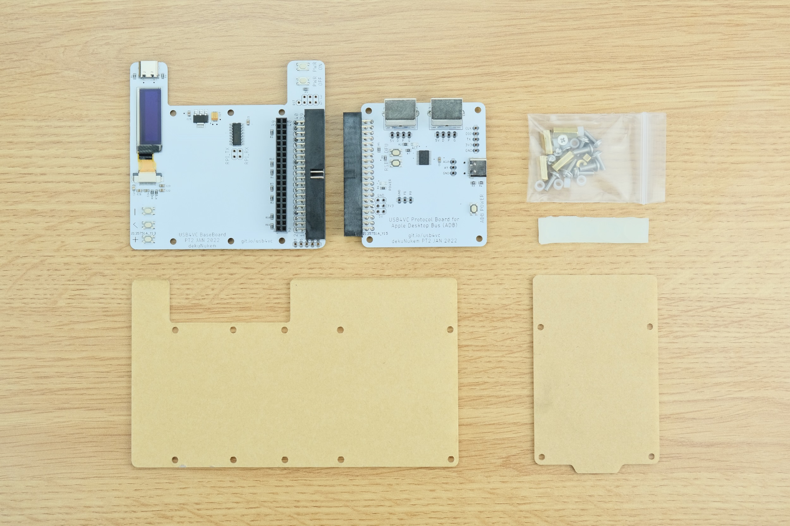
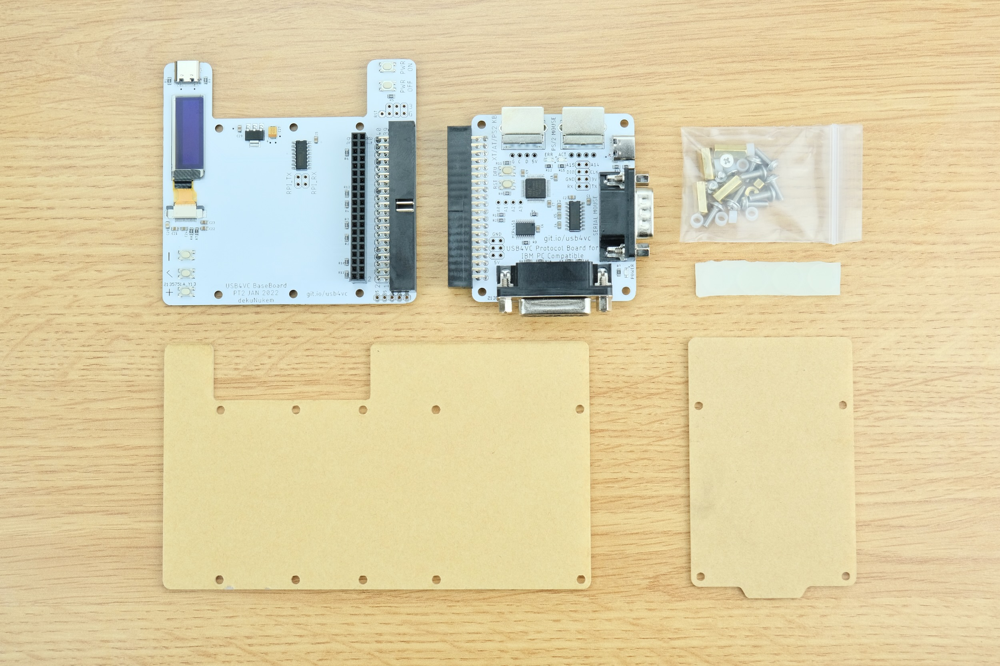

# USB4VC Launch Plan

[Get USB4VC](https://www.kickstarter.com/projects/dekunukem/usb4vc-usb-inputs-on-retro-computers) | [Official Discord](https://discord.gg/HAuuh3pAmB) | [Getting Started](getting_started.md) | [Table of Contents](#table-of-contents)

---

Thank you very much for the interest and support of USB4VC!

Please consider [signing up launch notification](https://www.kickstarter.com/projects/dekunukem/usb4vc-usb-inputs-on-retro-computers) and join our [Discord Chatroom](https://discord.gg/HAuuh3pAmB) for the latest news and updates!

More information will become available as launch plan is finalised. [Click me](README.md) to learn more about USB4VC itself, including the [ongoing beta testing program](README.md#beta-testing)!

## Launch Timeline

#### February - March 2022

* Public Beta Testing

* Gather Feedback, Fix Bugs, Finishing Touches.

* Write Documentations

#### March - April 2022

* Kickstarter Campaign

* Arrange Production Run

#### April 2022 Onwards

* Fulfilling Kickstarter Order

* Public Release

* Work on Improvements, More Protocols and Protocol Cards

Timing might change depending on circumstances such as component availability and feedback results. This is just an estimate.

## Launch Date, Duration, and Funding Goal

Exact launch date has not been determined yet, but I'm aiming for **early March 2022**.

Duration should be around 25 days, with campaign ending in **early April**.

Funding goal is planned to be around **5000GBP** for the first production run. Costs include components, manufacturing, accessories, shipping and expenses.

As mentioned before, more details will become available as launch plan is finalised. So please consider [signing up launch notification](https://www.kickstarter.com/projects/dekunukem/usb4vc-usb-inputs-on-retro-computers) and join our [Discord Chatroom](https://discord.gg/HAuuh3pAmB) for latest developments.

## Rewards

* **`Three reward tiers`** are planned.

* Exact pricing is still under consideration, but is expected to be under 100 USD.

* USB4VC will be shipped in **`kit form`**. You can [put it together](kit_assembly.md) in less than 10 minutes, **`no soldering needed`**.

### Tier 1: Baseboard + Apple Desktop Bus (ADB) Protocol Card

* USB4VC Baseboard
* USB4VC Apple Desktop Bus (ADB) Protocol Card
* Acrylic Front & Back Plates
* Fasteners
* Silicone anti-flip feet
* Free stretch goal rewards! (to be determined)

### Tier 2: Baseboard + IBM PC Compatible Protocol Card

* USB4VC Baseboard
* USB4VC IBM PC Compatible Protocol Card
* Acrylic Front & Back Plates
* Fasteners
* Silicone anti-flip feet
* Free stretch goal rewards! (to be determined)

### Tier 3: Baseboard + IBM PC + ADB Protocol Card

* USB4VC Baseboard
* USB4VC Apple Desktop Bus (ADB) Protocol Card
* USB4VC IBM PC Compatible Protocol Card
* Acrylic Front & Back Plates
* Fasteners
* Silicone anti-flip feet
* Free stretch goal rewards! (to be determined)

### Optional Extras

* You can purchase required cables as add-ons, or get them somewhere else. 

* Extra goodies will be included with every order **`for free`** if **`stretch goals`** are met.

## Shipping

USB4VC will be shipped from **`United Kingdom`**.

If you're already in UK, it will be posted via **[`Royal Mail 1st Class Signed For`](https://www.royalmail.com/sending/uk/signed-for-1st-class)**, which should arrive next-day.

For everywhere else, the default shipping will be **[`Royal Mail International Standard`](https://www.royalmail.com/sending/international/international-standard)**:

* $8
* Untracked
* Typically 1 week for Europe
* Typically 2 weeks for everywhere else
* Proof of posting available

Optionally, you can upgrade to **[`Royal Mail International Tracked & Signed`](https://www.royalmail.com/sending/international/international-tracked-signed)**:

* $16
* End-to-end tracking
* Signature on delivery
* Typically 1 week for Europe
* Typically 2 weeks for everywhere else
* Proof of posting available

Finally, you can also upgrade to **[`DHL Express Worldwide`](https://www.dhl.co.uk/en/express.html)**:

* $49
* Within 3 working days
* End-to-end tracking 
* Signature on delivery

## Stay Updated / Get in Touch / Questions & Comments

Please consider [signing up launch notification](https://www.kickstarter.com/projects/dekunukem/usb4vc-usb-inputs-on-retro-computers) and join our [Discord Chatroom](https://discord.gg/HAuuh3pAmB) for the latest news and updates!

You can also raise a [Github issue](https://github.com/dekuNukem/USB4VC/issues), [DM on Twitter](https://twitter.com/dekuNukem_), or email `dekunukem` `gmail.com`

## Table of Contents

[Main page](README.md)

[(Youtube Video) USB4VC in Action](https://www.youtube.com/watch?v=H8XEUh1vhFY)

[Getting Started Guide](getting_started.md)

[Kit Assembly Guide](kit_assembly.md)

[Technical Notes](technical_notes.md)

[Launch Plan / Kickstarter Info](kickstarter_info.md)

