# USB4VC Kit Assembly

[Get USB4VC](https://www.tindie.com/) | [Official Discord](https://discord.gg/4sJCBx5) | [Getting Started](getting_started.md) | Table of Contents

----

Thanks for getting USB4VC! Here is a quick guide on how to put everything together.

## Recommended Tools

A small Phillips-head screwdriver (`+`shape) should be included in the package.

A pair of pliers would make tightening the fasteners easier, but not required.

## Handling Bare Circuit Boards

To reduce the risk of damage from static discharge:

* Wash your hands first

* Always hold the circuit board by its edge

* Don't touch the components

## Assembly Steps

By now, you should have:

* USB4VC Baseboard

* USB4VC Protocol Card(s)

* Raspberry Pi 1/2/3/4 Model B

* Acrylic Plates

* Mini Screwdriver

* Fasteners

* Anti-slip feet

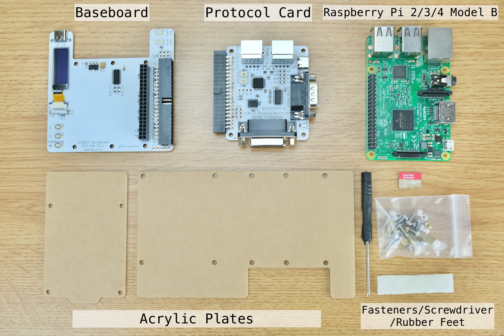

You should have the following fasteners, take note of what they look like :)

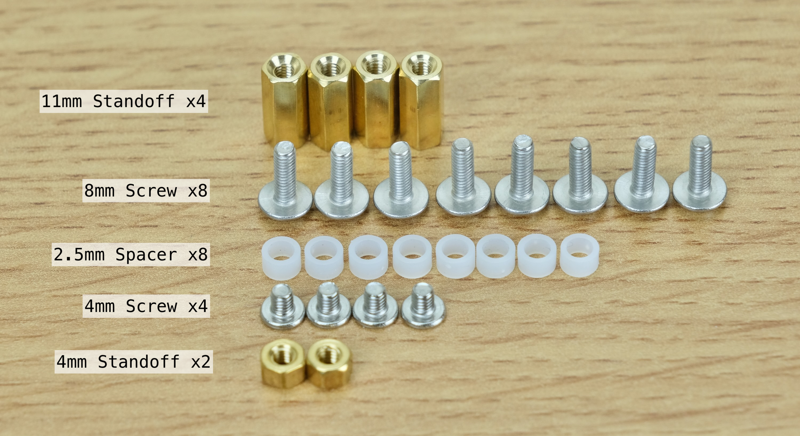

Start by peeling off the protective layer on acrylic plates:

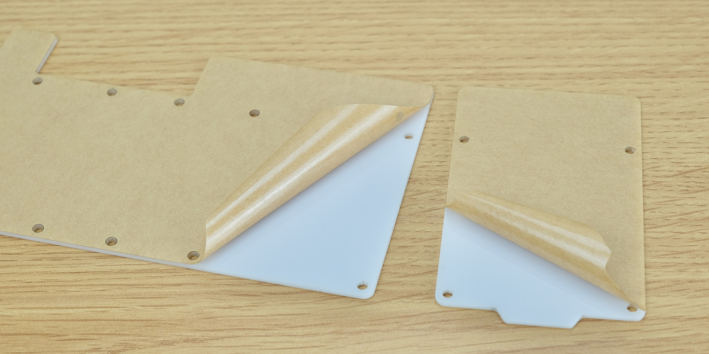

Orient plate the plate as shown, insert four `8mm Screws` into the marked holes:

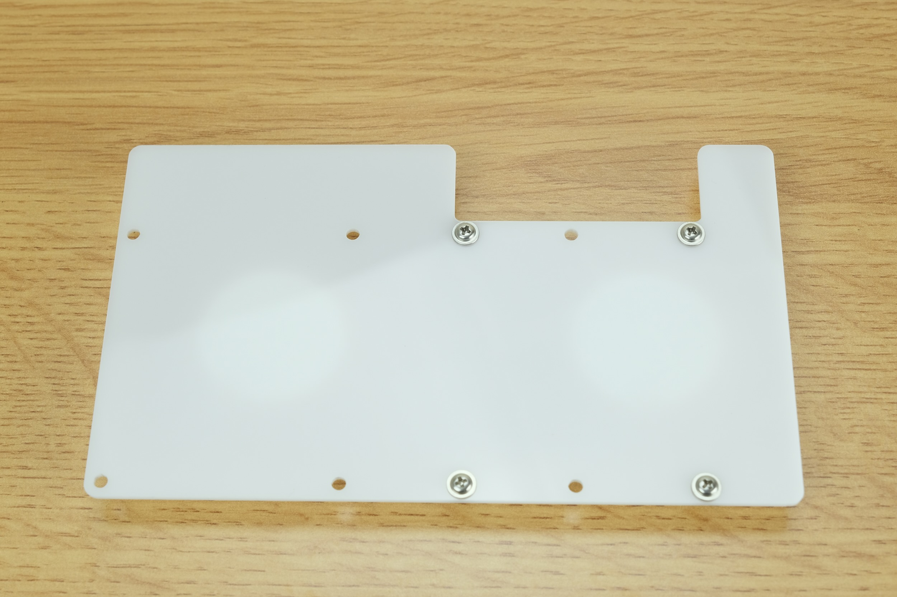

Put something rigid (cardboard, etc) over the screws, and flip the whole thing over.

The screws should stay in place, insert four `2.5mm Standoffs` over the screws:

Put the Baseboard over the screws, and install four `11mm Standoffs`, moderately tighten.

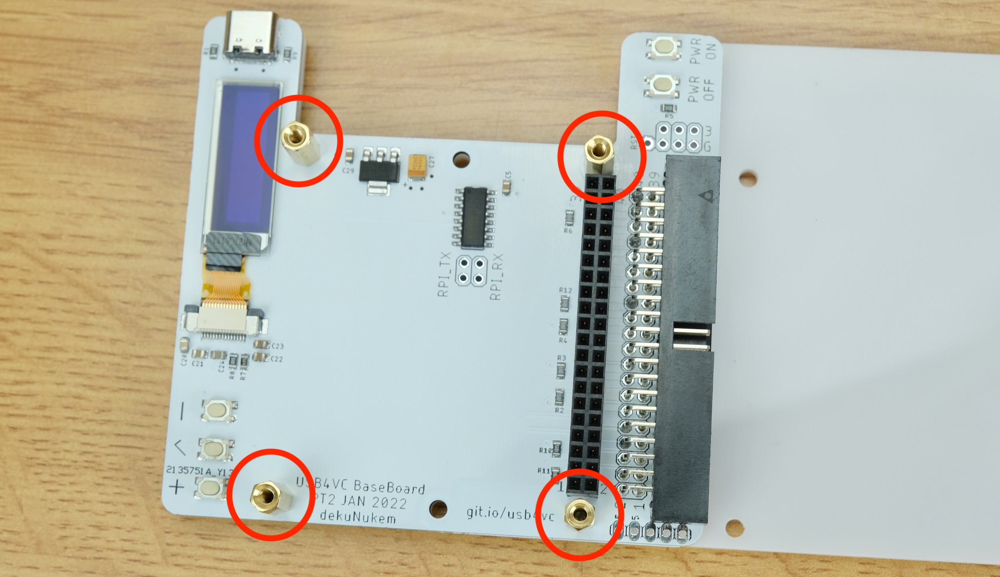

Plug your Raspberry Pi into the pin headers, push down gently until fully inserted, make sure everything is lined up.

Put four `2.5mm Spacers` over the holes.

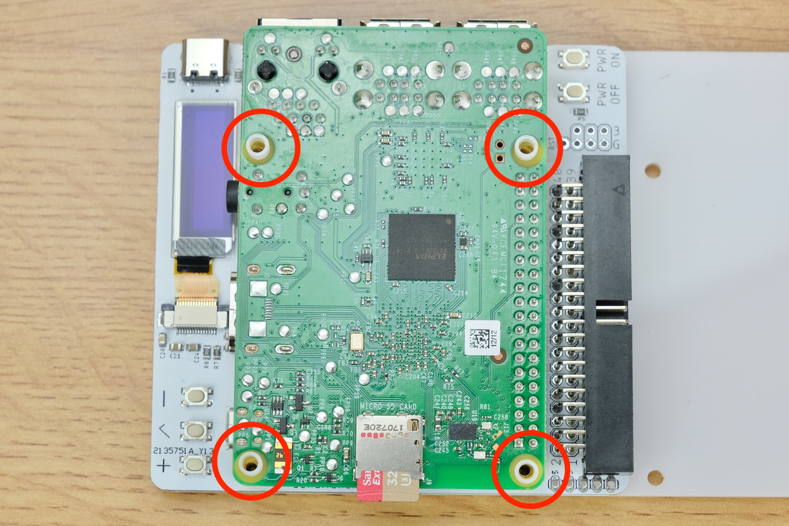

Position the top plate over the holes, make sure the plastic standoffs are not displaced. 

Screw the four `8mm Screws` into the metal standoffs underneath.

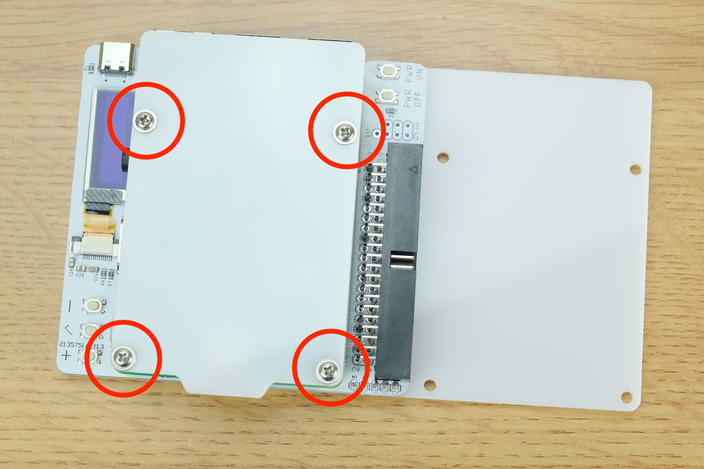

Insert two `4mm Screws` from the underside.

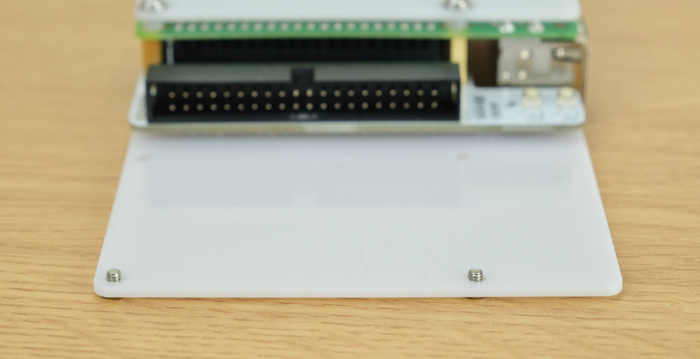

Install two `4mm Standoffs` from top. **DO NOT OVER-TIGHTEN!** Otherwise you might crack the acrylic. Finger-tight is OK.

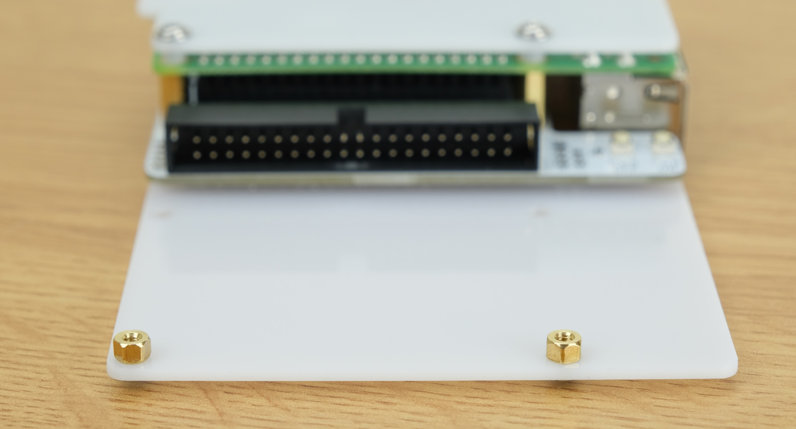

Insert the Protocol Card into the connector, and secure it with two `4mm Screws`.

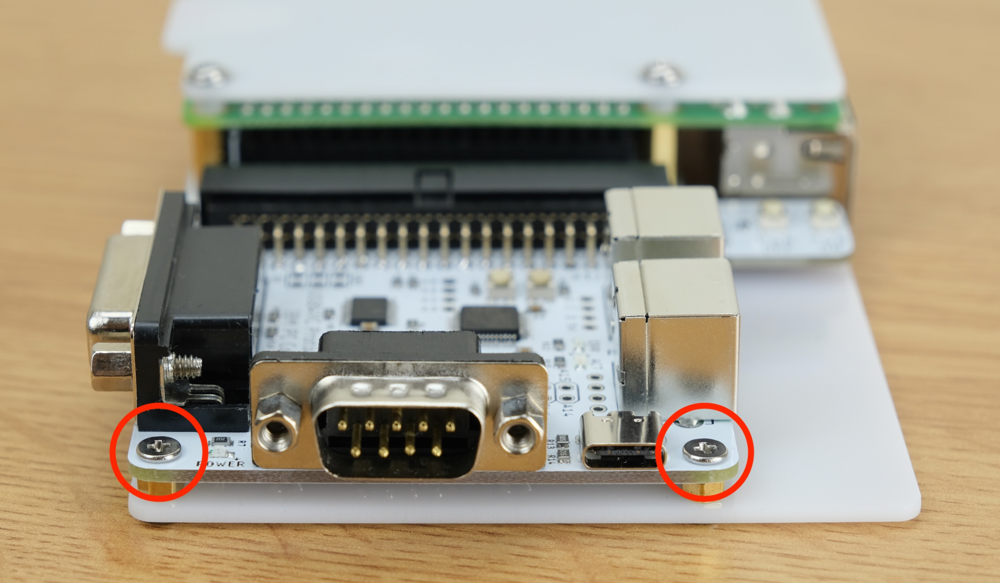

Flip it over, clean the area if dirty, and stick on the anti-slip feet on the corners:

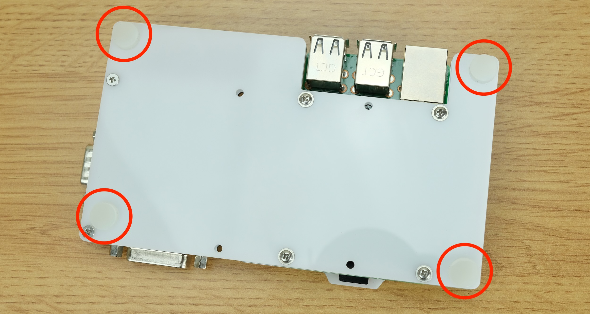

And you're done! Congratulations!

Head back to the [Getting Started Guide](getting_started.md#kit-assembly) to see how to use it.

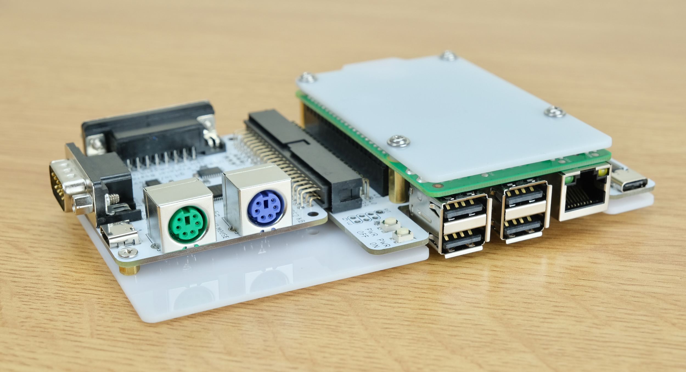

## Table of Contents

## Questions or Comments?

Feel free to ask in [official Discord](https://discord.gg/HAuuh3pAmB), raise a [Github issue](https://github.com/dekuNukem/USB4VC/issues), [DM on Twitter](https://twitter.com/dekuNukem_), or email `dekunukem` `gmail.com`!
