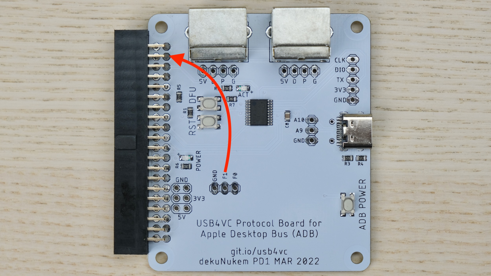
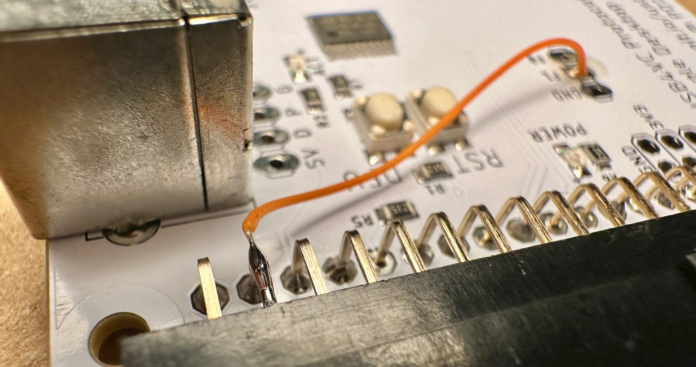
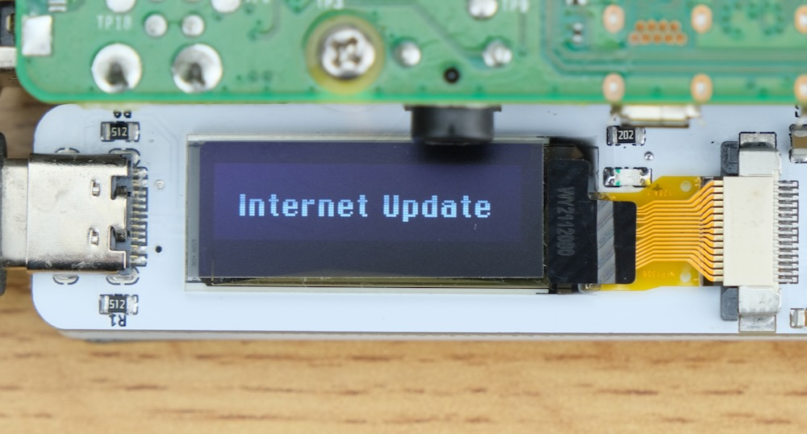

# USB4VC Protocol Card Stability Upgrade

[Get USB4VC](https://www.tindie.com/products/dekuNukem/usb4vc-usb-inputs-on-retro-computers/) | [Official Discord](https://discord.gg/HAuuh3pAmB) | [Getting Started](getting_started.md) | [Table of Contents](#table-of-contents)

-----

This document covers a solution that might improve the stability of USB4VC.

## Overview

A `BUSY` signal is added, to prevent Raspberry Pi from sending data when Protocol Card is talking to the computer.

This, along with a firmware update, should improve stability and reduce stuck keys or glitches.

## Instructions

### Solder a New Wire

Solder a wire between the pins at **`F1` and `second row of right most column`**. See photo:

Make sure **there are no short circuits**.

### Software Update

Connect RPi to internet. You can [set up WiFi](https://github.com/dekuNukem/USB4VC/blob/master/getting_started.md#optional-set-up-wifi), or plug in an Ethernet cable.

Then simply select Internet Update in main menu. It will update RPi code and P-Card firmware to latest version.

Confirm on the second screen that both PB and RPi version are **above 0.3.0**.

### Try it Out!

Let me know how it goes!

## Questions or Comments?

Feel free to ask in official [Discord Chatroom](https://discord.gg/HAuuh3pAmB), raise a [Github issue](https://github.com/dekuNukem/USB4VC/issues), [DM on Twitter](https://twitter.com/dekuNukem_), or email `dekunukem` `gmail.com`!

## Table of Contents

[Main page](README.md)

[(Youtube Video) USB4VC in Action](https://www.youtube.com/watch?v=54sdPELuu4g)

[Getting Started Guide](getting_started.md)

[Kit Assembly Guide](kit_assembly.md)

[Tinkering Guide / Make Your Own Protocol Card / Technical Notes](technical_notes.md)

[Kickstarter Acknowledgements](kickstarter_info.md)

