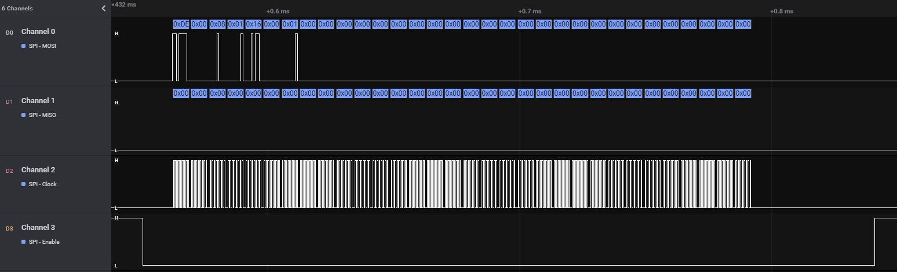
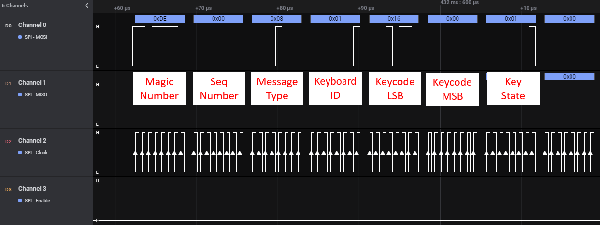
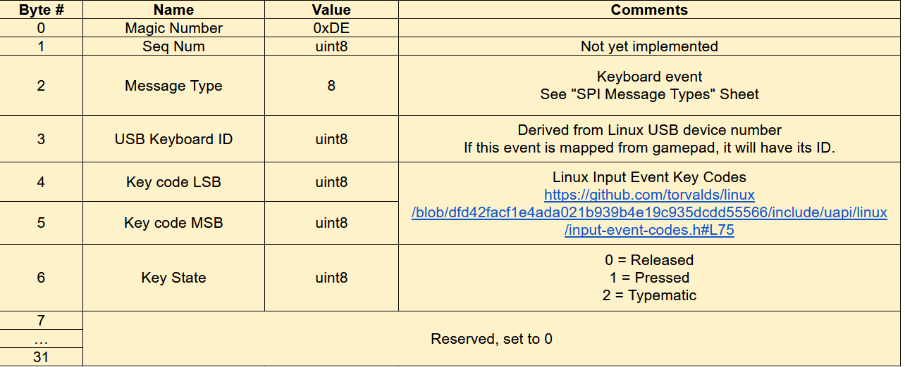
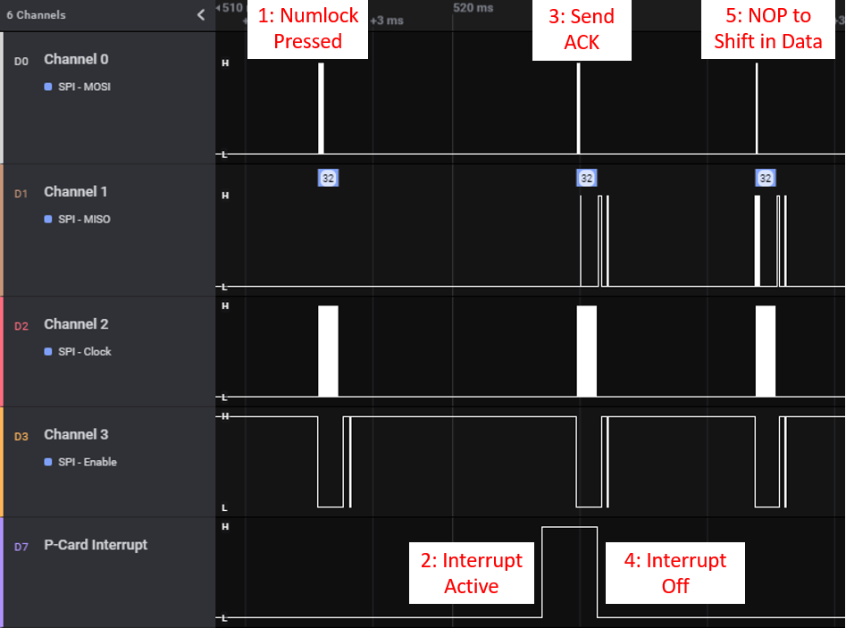
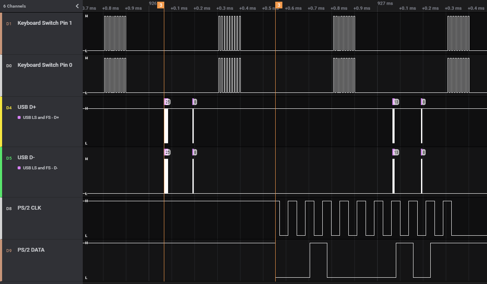
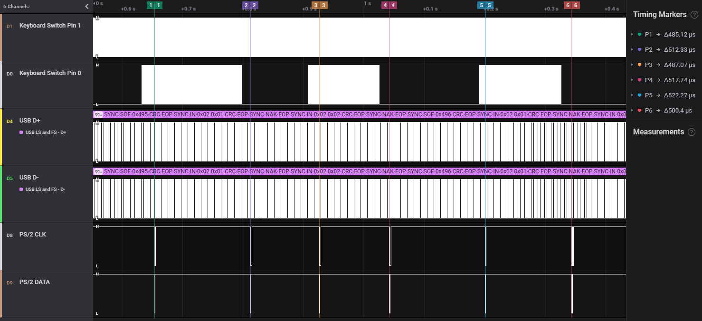
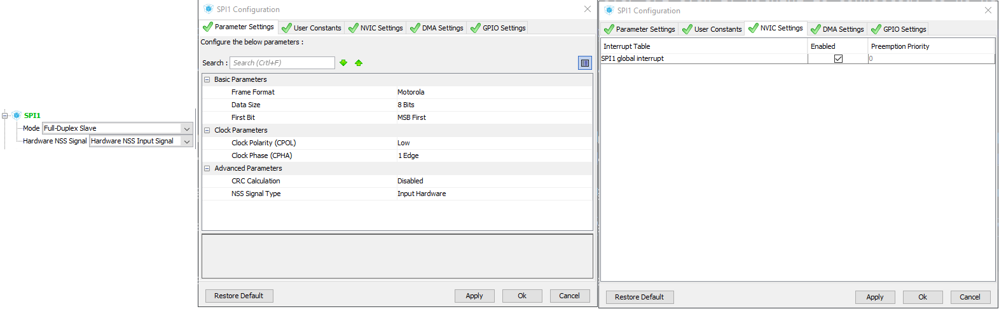

# USB4VC Technical Notes / Make Your Own Protocol Card

[Get USB4VC](https://www.kickstarter.com/projects/dekunukem/usb4vc-usb-inputs-on-retro-computers) | [Official Discord](https://discord.gg/HAuuh3pAmB) | [Getting Started](getting_started.md) | [Table of Contents](#table-of-contents)

-----

This document contains technical information about how USB4VC works. Please **read the whole article** if you're planning to make your own Protocol Cards.

## Linux Input Event Codes

First of all, how does USB4VC read from KB/Mouse/Gamepads in the first place?

The answer is Linux **Input Event Codes**. Here's a very simplified description:

* Connected input devices show up in `/dev/input` as files:

```
$ ls /dev/input/
event0  event1  event2  mice  mouse0  mouse1
```

* Reading from one of those files returns input events. Try `cat /dev/input/mice`!

* On RPi, **16 Bytes** are returned each time there is an event. They are arranged as follows:

| Byte  | Name        |
|-------|-------------|
| 0-7   | Timestamp   |
| 8-9   | Event Type  |
| 10-11 | Event Code  |
| 12-15 | Event Value |

* A list of all Event Type, Code and Values [can be found here](https://github.com/torvalds/linux/blob/master/include/uapi/linux/input-event-codes.h), set a bookmark if you're making your own P-Card!

* Keyboard keys and mouse/gamepad buttons are **EV_KEY** type, mouse moments are **EV_REL** (relative) type, and joystick movements are **EV_ABS** (absolute) type.

* Once you know the Event Type, you can look up Event Code to see which key/button/axes is being updated.

* Event Value will be 1 (pressed) or 0 (released) for buttons, and a signed value for relative or absolute axes.

* [Here's a good article](https://thehackerdiary.wordpress.com/2017/04/21/exploring-devinput-1/) that goes into a bit more details.

* You can install `evtest` and see what your device is returning in real time.

* USB4VC reads those events from all input devices, processes them, and send them out to the Protocol Card.

## Hardware Pinout

The Protocol Card connector directly maps to the Raspberry Pi Header, although the pins are flipped around.

Most pins are already in use:


* Protocol Card and OLED screen shares the same SPI bus, with different CS of course.

* Pin 22 is used to reset the P-Card, pin 32 for putting the microcontroller in bootloader mode for firmware updates.

* Pin 3 and 5 are connected to microcontroller I2C lines for firmware updates.

* A CH340 TTL-Serial-to-USB chip converts RPi serial (Pin 8 and 10) to USB-C on the Baseboard, currently unused.

* Pin 36 is P-Card-to-Baseboard interrupt pin, details in next section.

* 5V current should not exceed 2A.

* 3.3V current should not exceed 600mA.

## SPI Communication Protocol

Raspberri Pi communicates with Protocol Card through SPI. [Here's a quick introduction](https://www.circuitbasics.com/basics-of-the-spi-communication-protocol/) if you're unfamiliar.

RPi is master, P-card is slave. **SCLK is 2MHz**.

**Mode 0** is used. CPOL=0 (CLK idle low), CPHA=0 (data valid on CLK rising edge).

RPi and P-Card communicates via **fixed-length 32-byte packets**.

Detailed description of messaging protocol [can be found in this document](https://docs.google.com/spreadsheets/d/e/2PACX-1vTDylIwis3GZrhakGK0uXJGc_SAZ_QwySmlMfZXpSdFDH6zoIXs1kHX7-4wUTeShZth_n6tJH8l3dJ3/pubhtml#), note that there are **multiple pages**.

Here is a sample capture of pressing `U` on the keyboard:



* 32 Bytes are sent in a single CS activation.

* SCLK is 2MHz, the entire transmission take around 290uS.

Here is a close-up of the first few bytes:



Compare to the [keyboard tab in the document](https://docs.google.com/spreadsheets/d/e/2PACX-1vTDylIwis3GZrhakGK0uXJGc_SAZ_QwySmlMfZXpSdFDH6zoIXs1kHX7-4wUTeShZth_n6tJH8l3dJ3/pubhtml#):



## P-Card Interrupt Handling

When Protocol Card has data for RPi, it should prepare the SPI buffer, and switch its interrupt pin to HIGH ([Pin 36](#hardware-pinout)).

Upon detecting this change, RPi will send out an ACK message. Upon receiving, the P-Card switches the interrupt pin to LOW.

RPi will then send out another ACK (or NOP) message to shift the data from P-Card to itself.

Here is a sample capture:



Currently this feature is only used for changing keyboard LEDs.

## Sample SPI Message Captures

More **sample captures** [can be found here](https://github.com/dekuNukem/USB4VC/tree/master/captures/diy_samples).

Click one and press `Download`.

Open with [Saleae Logic app](https://www.saleae.com/downloads/).

## Latency Information

Input latency can be introduced during all stages of input chain. Using keyboard as example, we have:

* Step 1: Switch physically depressed

* Step 2: Keyboard sends out event on USB/Bluetooth

* Step 3: Raspberry Pi processes the event and informs Protocol Card

* Step 4: Protocol Card sends out the keystroke to retro computer

* Step 5: Retro computer responds to the keystroke.

The part we're interested in is **Step 3 and 4**, as any time spent here is the additional delay from USB4VC.

To accurately measure the delay, I used a logic analyzer connecting to keyboard USB lines and PS/2 output on the IBM PC Protocol Card. Here is the delay in action:



From the keystroke appearing on USB, to keystroke appearing on PS/2, it took 487 *microseconds*.

Zoomed out capture with multiple keypresses:



I tested out different generations of Raspberry Pis, and here is the result:

| RPi Generation | Avg. Latency |
|----------------|---------|
| 2              | 1ms     |
| 3              | 0.63ms  |
| 4              | 0.5ms   |

You can find the [capture files here](captures/latency), open with [saleae app](https://www.saleae.com/downloads/), search `PID ACK` for USB input events, more info [in this video](https://www.youtube.com/watch?v=wdgULBpRoXk)

## Making your own Protocol Card

By now you should have a general idea of how USB4VC works on a hardware level. So here are more information on how to get started on making your own Protocol Card!

### Any Restrictions?

Not really! USB4VC is under MIT license, so basically anything goes apart from liability and warranty.

Feel free to develop your own Protocol Cards, write about them, sell them, anything you want really.

### Recommended Equipment

* A **Logic Analyzer** is strongly recommended. You can use it to capture and decode digital signals, making troubleshooting much easier.

* I use a [Saleae Logic Pro 16](https://www.saleae.com/), it's a bit pricey but works very well. There are also cheaper ones available at the usual online marketplaces.

* An oscilloscope would work too, but the user interface might be more convoluted.

### Microcontroller Selection

The heart of a Protocol Card is the microcontroller. Picking one requires some considerations:

* It has to be **fast enough** to reliably read the 32-byte message at 2MHz SCLK **as SPI slave**, **AND** generate timing-critical signal to the retro computer.

* Able to tolerate 5V inputs, as is common for many retro computers.

* Economical and available for the quantity you're planning to make.

Here is a quick run-down of a few popular microcontrollers:

### Arduino, 8-bit ATmega-based. (UNO, Nano, Micro, Leonardo, etc)

#### PROs

* The obvious choice

* Lots of tutorials

* Cheap & available

* 5V tolerant

#### CONs

* Most runs at 16MHz, not sure if fast enough for 2MHz SPI signals.

* Not many resources on how to use them as SPI slaves. You might need to get cozy with configuration registers.

* Limited peripherals (timers, external interrupts, etc) and RAM and Flash memory.

* Overall just a bit underpowered, but I'm sure Atmel wizards can squeeze every bit of juice out of it :)


### ARM-Based Development Boards (Teensy, ESP32, RP2040, etc)

#### PROs

* Those chips can be very fast (hundreds of MHz), and you can probably just brute force through any timing issues.

* Very popular too, so many resources are available.

#### CONs

* Can be expensive, especially for volume production.

* Might not be 5V tolerant

* Availability concerns

### Bare ARM Chip (STM32, NXP LPC, etc)

Finally, you can just program a bare 32-bit ARM microcontroller yourself.

#### PROs

* Complete control and flexibility in programming.

* Able to integrate into your own Protocol Card on a single PCB.

* Lowest cost, many parts to choose from at different price points and performance levels.

#### CONs

* Learning curve

* Not as many resources online

---

In conclusion, my suggestion would be:

* For **one-off designs**: A well-supported **high-powered ARM dev board** such as [Teensy](https://www.pjrc.com/store/) to brute force way through any timing issues.

* For **volume production**: Bare **ARM MCUs** such as STM32, and design your own circuit board.

* I have written a [tutorial on STM32 development](https://github.com/dekuNukem/STM32_tutorials), which should get you started.

### Typical Development Steps

With your microcontroller chosen, here is how I would approach starting a new Protocol Card:

#### Research the protocol!

First of all, look up the protocol and get as much details as you can!

* Can your MCU handle the **voltage level**? (5V/12V)

* Does it involve a particular MCU peripheral? (UART, timers, external interrupts, etc)

* Does it need a **special driver**? (RS485)

* How tight is the **timing**?

* Does the host poll at regular interval (ADB) or can you send an event at any time (PS/2)?

#### Reference waveform

If possible, use a logic analyzer or oscilloscope to **capture a sample waveform** with a **real retro peripheral**.

You might need to make a pass-through cable that exposes the signal lines.

No matter how good the documentation, nothing beats a reference capture from the real deal. This way you can verify the documentation is correct, and have something to compare to down the line.

#### SPI wire-up

Baseboard will send Keyboard/Mouse/Gamepad events over SPI even if nothing is connected, so no need to worry about that.

Take a look at the [pinout section](#hardware-pinout), connect your dev board to appropriate power, ground, and SPI pins.

SPI pins are 23, 21, 19, and 24. Also make sure everything is on the same ground.

#### Get SPI working

Use your logic analyzer or oscilloscope to confirm the SPI waveform is correct, and making sure the MCU can reliably receive SPI messages without data corruption and dropouts. See [SPI protocol section](#spi-communication-protocol) for details.


This is important as any SPI message corruption might result in missed inputs or wrong inputs being sent to retro computer.

Try start simple and sending single keyboard key strokes. Print the received message out, and compare with [this document](https://docs.google.com/spreadsheets/d/e/2PACX-1vTDylIwis3GZrhakGK0uXJGc_SAZ_QwySmlMfZXpSdFDH6zoIXs1kHX7-4wUTeShZth_n6tJH8l3dJ3/pubhtml#).

----

For ARM-based MCUs, you can usually receive messages as SPI slave in interrupt mode. Tell it you need 32 Bytes, and an interrupt callback will fire once the message has been received. [See my tutorial](https://github.com/dekuNukem/STM32_tutorials) for more information, see also the [code for existing P-Cards](https://github.com/dekuNukem/USB4VC/blob/master/firmware/ibmpc/Src/main.c).

For STM32, set up SPI as follows:



Then use `HAL_SPI_TransmitReceive_IT()` to start listening, and `HAL_SPI_TxRxCpltCallback()` will fire when message is received.

#### Work on protocols

Once SPI is working, you can move on to implementing the protocol itself. A few general tips:

* Popular protocols tends to have Arduino libraries already written, and you can modify/convert them to suit your needs. Double check the license though!

* Use the logic analyzer or oscilloscope to compare your output with the reference and make sure the timing is spot-on.

* Once working, try rapid inputs (mashing keyboard, moving mouse fast), simultaneous inputs (mashing keyboard/mouse/gamepad at same time) and see if any issue arises. And use it for a few hours to verify stability.

#### Tips and tricks

* If using interrupts to read SPI messages, keep the ISR short! 

* For example just copy everything into a buffer in ISR, and process it in the main loop.

* If designing your own PCB, you can refer to a lot of open-source vendors such as Sparkfun and Adafruit.

* Just find a relevant product and download the schematics and PCB files, they are often production tested, so a great starting point to make your own!

### Unique Protocol Card ID

Once your own P-Card has been tried and tested, it can be given a unique ID so the Baseboard can properly recognise it and display its protocol in the menus.

I'm still fleshing out how this will work, expect an update soon!

## Questions or Comments?

Feel free to ask in official [Discord Chatroom](https://discord.gg/HAuuh3pAmB), raise a [Github issue](https://github.com/dekuNukem/USB4VC/issues), [DM on Twitter](https://twitter.com/dekuNukem_), or email `dekunukem` `gmail.com`!

## Table of Contents

[Main page](README.md)

[(Youtube Video) USB4VC in Action](https://www.youtube.com/watch?v=54sdPELuu4g)

[Getting Started Guide](getting_started.md)

[Kit Assembly Guide](kit_assembly.md)

[Technical Notes](technical_notes.md)

[Launch Plan / Kickstarter Info](kickstarter_info.md)

